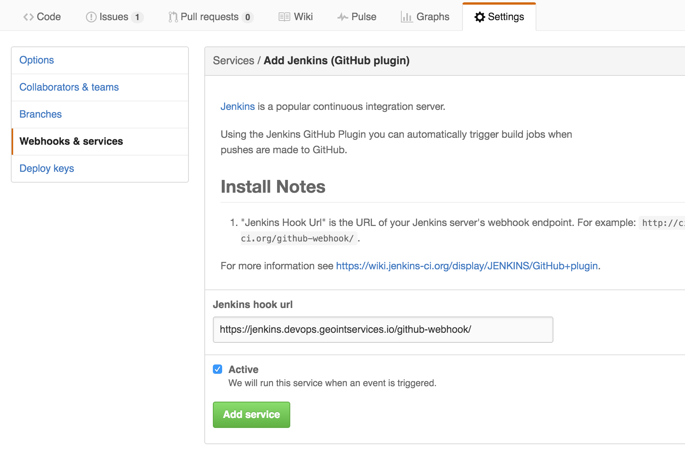

# Piazza Devops

* [Credentials](#credentials)
* [Cloud Foundry (The Platform)](#cloud-foundry)
  - [Local Development](#local-development)
  - [Backing Services](#services)
* [Jenkins (Automation)](#jenkins)
  - [Special Features](#special-sauce)
* [Nexus (Artifact Repository)](#nexus)
* [Roadmap](#roadmap)

## Credentials

* You'll need to setup an LDAP account with [GEOINT Services](https://accounts.geointservices.io/).
* Make sure you can access [our Jenkins organization](https://jenkins.devops.geointservices.io/job/piazza/).

## Cloud Foundry

### Local Development
* [Install](https://github.com/cloudfoundry/cli#downloads) the `cf` CLI client.
* Login to PCF:

  ```
    cf login -a https://api.devops.geointservices.io
    # Note: for `email`, use your GEOINT Services LDAP username
    cf target -o piazza -s simulator-dev
  ```

* The `dev` space is the sandbox environment for piazza devs.
* `simulator-stage` is the space jenkins will use to stage apps.
* Useful commands:

  ```
    cf apps                      # list all apps
    cf app <app>                 # individual app info
    cf env                       # view an apps current environment variables
    cf logs --recent <app>       # show recent logs for an app
    cf logs <app>                # tail and follow logs for an app
    cf marketplace               # view a list of available marketplace services
    cf push                      # push an app to Cloud Foundry
    cf services                  # view a list of running services
  ```
* And there is also a [Web UI](https://login.devops.geointservices.io/login).

### Services
* Bind a service to your app using the `manifest` to expose `VCAP_SERVICES`:

  ```
    services:
      - pz-postgres
      - pz-blobstore
  ```

* Available services:
  - `pz-blobstore` - s3 bucket
  - `pz-geoserver`
  - `pz-geoserver-cluster` - geoserver + s3 + postGIS
  - `pz-kafka`
  - `pz-postgres`
  - `pz-zookeeper`
  - `pz-mongodb`
  - `pz-elasticsearch`
* Sample `VCAP_SERVICES` json:

  ```
    {
      "VCAP_SERVICES": {
        "user-provided": [
          {
            "credentials": {
              "bucket": "pz-blobstore-staging"
            },
            "label": "user-provided",
            "name": "pz-blobstore",
            "syslog_drain_url": "",
            "tags": []
          }
        ]
      }
    }
  ```

* Backing Services come from one of three possible locations:
  - AWS FADE: LDAP.
  - pz-infrastructure: our VPC.
  - PCF Marketplace: `cf marketplace`

#### Using Services Locally

Our backing services are only accessible from 2 locations: Cloud Foundry and our bastion host. If you want to interact with a backing service from your local machine, you'll have to set up an ssh tunnel through one of those two locations.

##### Via Cloud Foundry
* Bind a service to your app, or find an app that is already bound to the service you'd like to access.
* Find the ip and port of the service in the `VCAP_SERVICES` environment variable: `cf env <app>`
* Run the following command:

  ```
    cf ssh <app> -N -L 3333:<ip-address>:<port>
  ```
* You should now be able to interact with the service via `localhost:3333`.
* _Note: you can tunnel through any running PCF app to our backing services (the service does not need to be bound to the app), but you'll need to know the address!_

##### Via Bastion
* Generate an ssh key-pair:

  ```
    ssh-keygen -q -t rsa -b 4096 -f $HOME/.ssh/venice.pem -P '' -C <your-email>
  ```

* Copy the contents of `$HOME/.ssh/venice.pem.pub` and send them to [@sbaxter](https://github.com/sbaxter) or [@wgb](https://github.com/wgb).
* We'll send you some information about the network...
* Then use the following command to set up your tunnel:

  ```
    ssh -f -N -i $HOME/.ssh/venice.pem -o ExitOnForwardFailure=yes -p <SSH_PORT> -L 3333:<INTERNAL_DNS>:<PORT> <SSH_USER>@<BASTION>
  ```
* You should now be able to interact with the service via `localhost:3333`
* To tear the tunnel down:

  ```
    ps -ef | grep venice.pem | grep -v grep | awk '{print $2}' | xargs kill -9
  ```

## Jenkins

* All jobs are generated and maintained using the [jenkins seed job](https://github.com/venicegeo/jenkins).
* All jobs publish status to [slack](https://venicegeo.slack.com/messages/jenkins/).
* Connect your github repo to jenkins:
  - Go to github.com/venicegeo/<your-repository> and navigate to `Settings -> Webhooks & Services -> Services -> Add service -> Jenkins (GitHub plugin)`
  - Webhook URL: `https://jenkins.devops.geointservices.io/github-webhook/`

* Create automation scripts:
  - `./ci/` - holds any scripts you'd like jenkins to use in building, testing, and deploying your project.
    - `./ci/<job-name>.sh` corresponds to the `<job-name>` in your Jenkins pipeline.
* Add your repo to the [Jenkins Projects list](https://github.com/venicegeo/jenkins/blob/geoint/Projects.groovy):

    ```
    static projects = [
      [
       name: 'my-app',
       pipeline: ['test', 'archive', 'stage']
      ]
    ]
    ```
* All jobs will only build master by default, but you can specify branches useing the `branch` key in your project map:
  - `branch: '**'` will build all branches.

### Special Sauce
* Versioning - the automation pipeline follows a versioning convention that is coupled with the git revision (i.e. we're not aiming for human readability).
* `./ci/vars.sh` - projects should provide the automation with a file `./ci/vars.sh` that defines two variables `APP` and `EXT`:

  ```
    APP=pz-app
    EXT=jar
  ```

* `archive` - archive jobs automagically push your artifact to nexus.
  - Required: `./ci/archive.sh` needs to build your artifact and move it to `./$APP.$EXT`.
* `stage` - stage jobs automagically in Cloud Foundry.
  - Required: `manifest.jenkins.yml` - a manifest specific to Jenkins (and the staging environment).
* `deploy` - complete the blue/green deploy for an app.
* `blackbox` - make sure newman is available
* Static file projects - the automation will expect a `tar.gz` file to push to nexus; it is recommended to do something like: `./ci/archive.sh`:

  ```
    #!/bin/bash -ex

    pushd `dirname $0`/.. > /dev/null
    root=$(pwd -P)
    popd > /dev/null

    # APP=<my-project>
    # EXT=tar.gz
    source $root/ci/vars.sh
    tar -czf $APP.$EXT -C $root <directory-that-contains-the-static-files>
  ```

* Binary projects (I'm looking at you `golang`) - `EXT=bin` lets the automation know we're dealing with an executable.
* The seed job will organize your project's jobs into a folder:

* The seed job will create a pipeline view for you:


## Nexus

* We store build artifacts in [Nexus](https://nexus.devops.geointservices.io/).
* Accessing locally - configure maven:

  ```
    <?xml version="1.0"?>
    <settings>
      <servers>
        <server>
          <id>nexus</id>
          <username>YOUR_LDAP_USERNAME</username>
          <password>YOUR_LDAP_PASSWORD</password>
        </server>
      </servers>
    </settings>
  ```

## Roadmap

* `jenkins.yml`: control jenkins from your project's repository (no more editing the seed job).
* PCF Service Controller - dynamically provision resources from `pz-infrastructure`.
